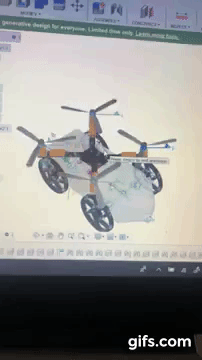
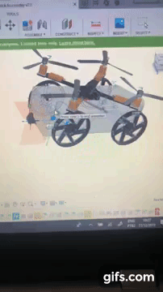
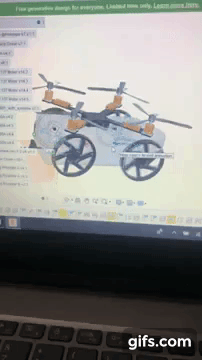

# chocobbo
This is a multiterrain vehicle that is able to walk in ground terrains, like a car.
And also sail, like a boat.
And is able to fly like a drone too.

I know, it seems too much, but that's exactly the idea, since most people take so many reckless actions when in danger in cases of natural disasters and due to that, end up dying or getting hurt.

## Objective
The main idea of this project is to develop a type of vehicle that enables people, not only the USAR (urban search and rescue) teams, but anyone to help in cases of natural disasters by flying, driving or swimming around the desired area and using the embedded camera to detect if there's any person there.

If so, you can send back the GPS coordinates to the owner's device, or start screaming with a buzzer, or even deliver medications/other things attached to the vehicle to that person.

## Prototype

## Simulation

### Multiterrain vehicle flying

### Multiterrain vehicle driving/sailing

### Multiterrain vehicle steering

## Etymology
The origin of the name is a tribute to the Chocobo® character from Final Fantasy®, due to the fact that the character is able to walk through all of those terrains, and also because i'm a huge fan of those games.

## Tasks concluded
- Design a prototype
- 3d print the prototype
- Add neural network to object detection

## Tasks to do
- Design the controller
- Improve the prototype
- Improve the control algorithm
- Improve the 3d printings smoothness
- Improve neural network architecture
- Add more tasks to the vehicle

## Who am I?
I'm Ryoji Kuwae Neto, data scientist for a little more than a year now, and a robotics student for the last 10 years of my life, graduated in Electronics Engineering and i'm also pursuing a post graduation in Mechatronics Systems. I think this is it, and I'm also trying to become an expert in data science, but this will take time to acquire certain skills, since there is a lot of people with more than 40 years in that area.

** FINAL FANTASY is a registered trademark of Square Enix Holdings Co., Ltd.
